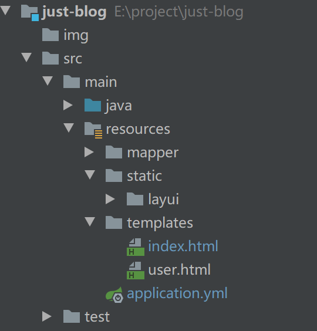

#### 一 配置内容
##### 1 无法加载static下的目录内容
> 解决SpringBoot中无法访问js、css、img等静态资源的问题 - 一一哥的文章 - 知乎
  https://zhuanlan.zhihu.com/p/142579290

解决方法是，我们在引用静态资源时，不需要目录前添加"/static/"
对应的目录结构内容：

错误的加载路径：

```html
    <link rel="stylesheet" href="/static/layui/css/layui.css">
```
正确的加载路径：
```html
    <link rel="stylesheet" href="layui/css/layui.css">
```
##### 2 实现热部署
> Spring Boot 怎么实现热部署 - Java技术栈的文章 - 知乎
https://zhuanlan.zhihu.com/p/63381268

> https://blog.csdn.net/qq_41800278/article/details/105699742

